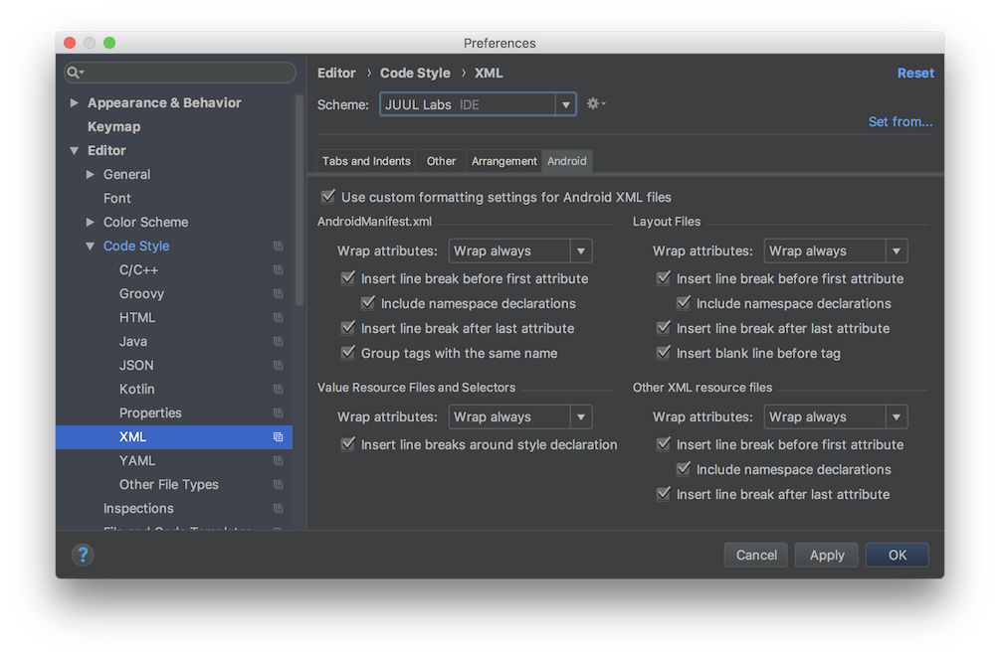

# Kotlin Code Styles

IntelliJ IDEA code style settings for JUUL Labs' Kotlin and Android projects.

## Installation

Clone this repository:

```bash
git clone git@github.com:JuulLabs-OSS/kotlin-code-styles.git
```

 Run the install script:

```bash
cd kotlin-code-styles/
./install.sh
```

Apply JUUL Labs' code style settings:

 - Restart Android Studio and/or IntelliJ if they're running
 - Open Project Settings (⌘ + `,`)
 - Navigate to `Editor` → `Code Style`
 - Select `JUUL Labs` from the `Scheme` dropdown

## Preferences

Follows the [Kotlin style guide] with the following additional configurations.

| Indentation                     | Spaces  |
|---------------------------------|:-------:|
| Tab size                        | `4`     |
| Indent                          | `4`     |
| Continuation indent<sup>1</sup> | **`4`** |

<sup>1</sup> _`Continuation indent` of `4` is used instead of the suggested `8`.
See [#1] for details._

### Editor → Code Style → XML → Android



## License

[](http://creativecommons.org/licenses/by/4.0/)

This work is licensed under a [Creative Commons Attribution 4.0 International License](http://creativecommons.org/licenses/by/4.0/).


[Kotlin style guide]: https://developer.android.com/kotlin/style-guide
[#1]: https://github.com/JuulLabs-OSS/kotlin-code-styles/issues/1
